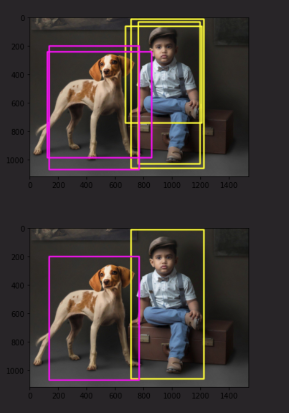
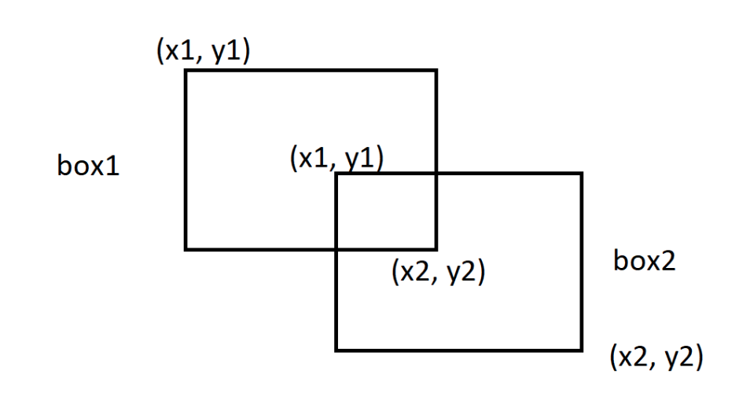
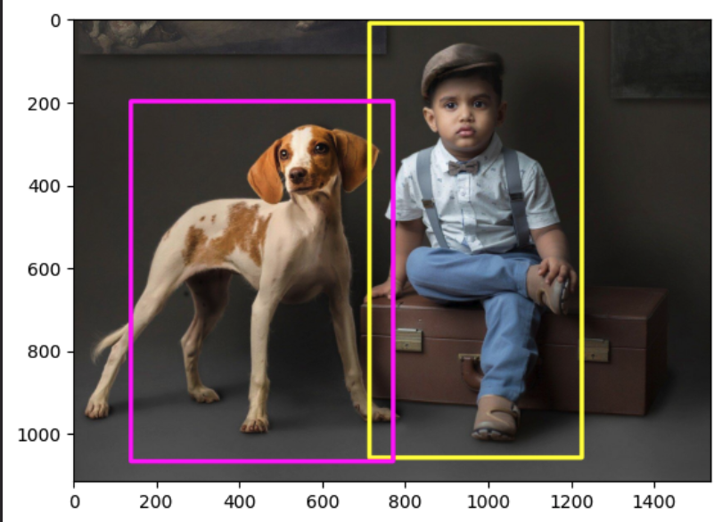
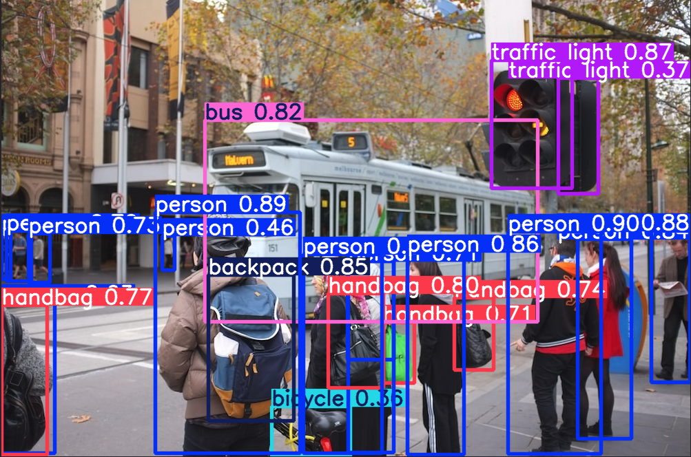
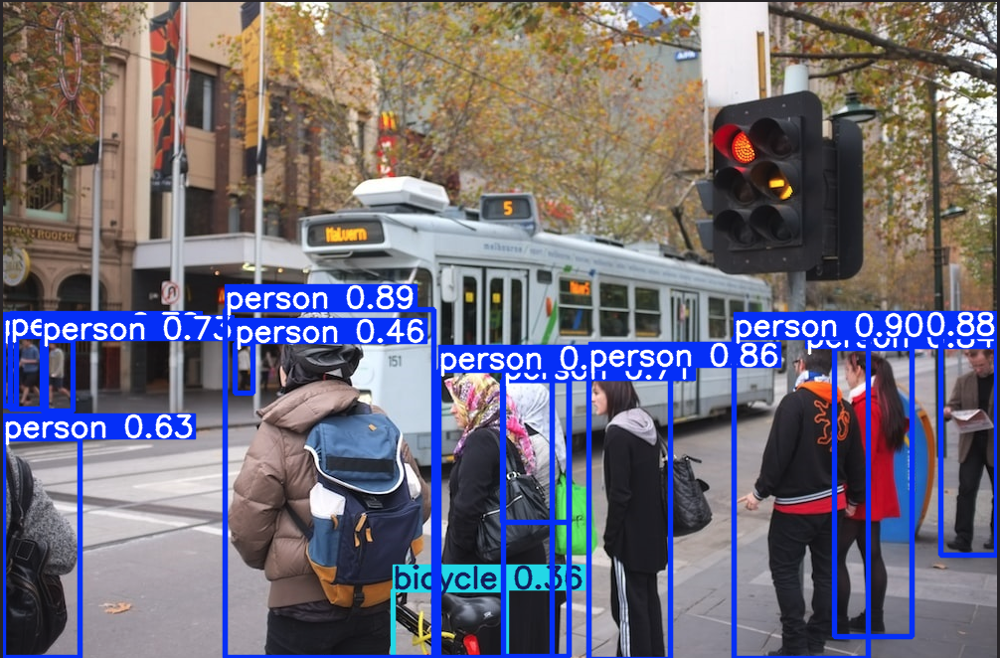
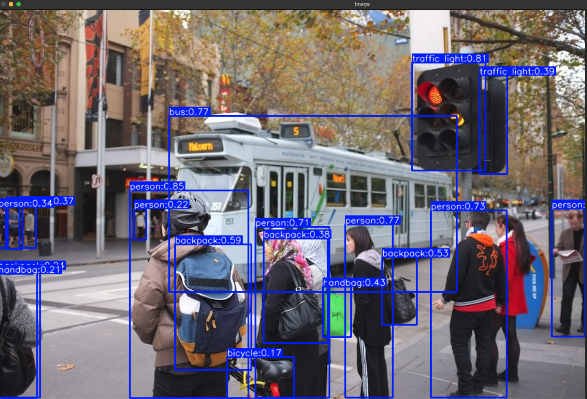
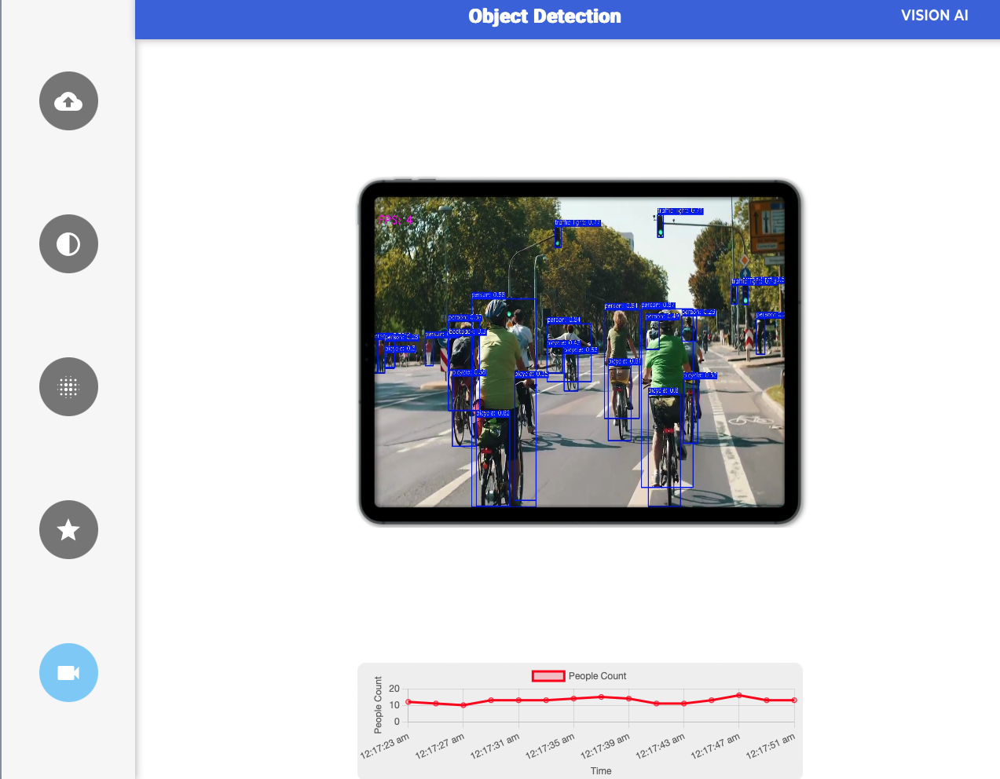
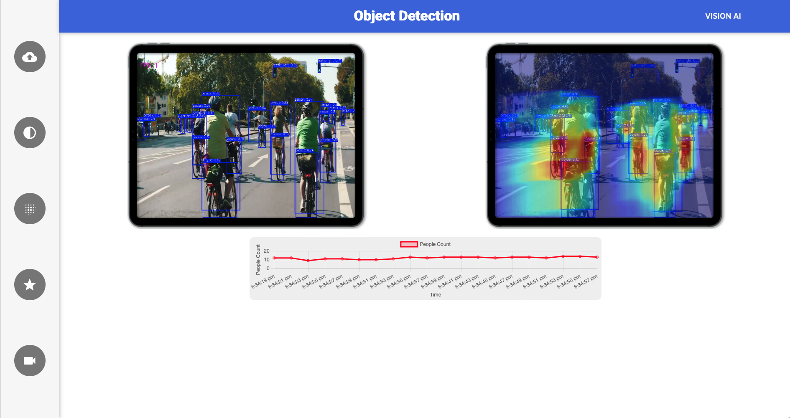

# Comprehensive YOLOv12 Project Documentation

This document consolidates documentation from various projects leveraging YOLOv12 and related computer vision techniques, covering non-max suppression, basic inference, performance analysis, specific applications (pothole detection, PPE, tennis analysis), and web deployment with Flask.

## 📖 Table of Contents

- [🚧 Pothole Detection Using YOLOv12](#-pothole-detection-using-yolov12)
  - [📌 Objective](#-objective)
  - [⚙️ System Requirements (Specific to Pothole Project)](#️-system-requirements-specific-to-pothole-project)
  - [📁 Dataset Preparation](#-dataset-preparation)
  - [🔧 YOLOv12 Setup (Specific to Pothole Project)](#-yolov12-setup-specific-to-pothole-project)
  - [🏋️ Model Training](#️-model-training)
  - [📈 Model Evaluation](#-model-evaluation)
  - [🔍 Model Inference](#-model-inference)
  - [📦 Model Export (Optional)](#-model-export-optional)
  - [✅ Keywords](#-keywords)
  - [🧠 Credits](#-credits)
- [Object Detection with Ultralytics YOLO (`yolo12x.pt`) on Images and Videos](#object-detection-with-ultralytics-yolo-yolo12xpt-on-images-and-videos)
  - [Overview](#overview)
  - [📦 Install All the Required Packages](#-install-all-the-required-packages)
  - [📚 Import All the Required Libraries](#-import-all-the-required-libraries)
  - [🧠 Load the YOLO Model (`yolo12x.pt`)](#-load-the-yolo-model-yolo12xpt)
  - [📥 Download Sample Image and Video](#-download-sample-image-and-video)
  - [🖼️ Object Detection in Images using `yolo12x.pt`](#️-object-detection-in-images-using-yolo12xpt)
  - [💾 Save the Model Predictions](#-save-the-model-predictions)
  - [🎯 Model Predictions on Specific Classes](#-model-predictions-on-specific-classes)
  - [🎬 Object Detection in Videos using `yolo12x.pt`](#-object-detection-in-videos-using-yolo12xpt)
  - [🖥️ Display the Output Video](#️-display-the-output-video)
- [YOLO Object Detection and Blurring Scripts (using Ultralytics)](#yolo-object-detection-and-blurring-scripts-using-ultralytics)
  - [Description](#description)
  - [Features](#features)
  - [Code Explanation Highlights](#code-explanation-highlights)
    - [Common Components (Both Scripts)](#common-components-both-scripts)
    - [Blurring Logic (`obj_blurring.py` only)](#blurring-logic-obj_blurringpy-only)
  - [Configuration Parameters](#configuration-parameters)
  - [Screenshots](#screenshots)
    - [Object Detection Example (`main.py`)](#object-detection-example-mainpy)
    - [Blurred Object Detection Example (`obj_blurring.py`)](#blurred-object-detection-example-obj_blurringpy)
- [Non-Max Suppression (NMS) Implementation Demo](#non-max-suppression-nms-implementation-demo)
  - [Description](#description-1)
  - [Key Concepts](#key-concepts)
    - [Intersection over Union (IoU)](#intersection-over-union-iou)
    - [Non-Max Suppression (NMS)](#non-max-suppression-nms)
  - [Workflow / Functionality](#workflow--functionality)
    - [Import Required Libraries](#import-required-libraries)
    - [Download Sample Image](#download-sample-image)
    - [Download Bounding Box Predictions](#download-bounding-box-predictions)
    - [Read Predictions File](#read-predictions-file)
    - [Preprocessing Predictions](#preprocessing-predictions)
    - [Draw Initial Bounding Boxes](#draw-initial-bounding-boxes)
    - [Calculate IoU](#calculate-iou)
    - [Apply Non-Max Suppression (NMS)](#apply-non-max-suppression-nms)
  - [Input Data Format (`Predictions.txt`)](#input-data-format-predictionstxt)
  - [Output](#output)
  - [Code Explanation](#code-explanation)
- [YOLOv12 Custom PPE Object Detection Training on Kaggle](#yolov12-custom-ppe-object-detection-training-on-kaggle)
  - [Overview](#overview-1)
  - [Generated Outcome](#generated-outcome)
  - [Dataset](#dataset)
  - [Features](#features-1)
  - [Environment](#environment)
  - [Results](#results)
  - [Keywords](#keywords-1)
- [🎾 Tennis Analysis System](#-tennis-analysis-system)
  - [📊 Overview](#-overview)
  - [✨ Features](#-features)
  - [🌳 Project Structure](#-project-structure)
  - [🔬 Technical Details](#-technical-details)
- [Integrate-YOLOv12-Flask: Real-time Object Detection Web Application](#integrate-yolov12-flask-real-time-object-detection-web-application)
  - [✨ Features](#-features-1)
  - [📂 Project Structure](#-project-structure)
  - [🛠️ Technical Stack & File Explanations](#️-technical-stack--file-explanations)
  - [🔗 API Endpoints](#-api-endpoints)
    - [Object Detection Web - People Count](#object-detection-web---people-count)
    - [Object Detection Web - Intensity Heatmap](#object-detection-web---intensity-heatmap)
  - [Keywords](#keywords-2)
- [📦 Consolidated Setup and Usage](#-consolidated-setup-and-usage)
  - [Prerequisites](#prerequisites)
  - [Installation](#installation)
  - [Running the Applications](#running-the-applications)
    - [General Python Scripts (Detection, Analysis)](#general-python-scripts-detection-analysis)
    - [Jupyter Notebooks](#jupyter-notebooks)
    - [Flask Web Application](#flask-web-application)
    - [Kaggle Environment](#kaggle-environment)
- [Acknowledgments](#acknowledgments)

---

## Non-Max Suppression (NMS) Implementation Demo

### Description

This `non_max_suppression_final_final.ipynb` file provides a demonstration of the Non-Max Suppression (NMS) algorithm, a common and crucial post-processing step in object detection pipelines. The script takes a sample image and a set of pre-defined bounding box predictions (including coordinates, class ID, and confidence score), visualizes the initial "raw" predictions, applies NMS to filter redundant boxes, and then visualizes the final, refined predictions.

NMS helps to clean up the output of object detectors, which often produce multiple overlapping bounding boxes for the same object. By suppressing boxes that significantly overlap with a higher-confidence box of the same class, NMS ensures that each detected object is represented by a single, optimal bounding box.

This implementation uses OpenCV for image loading and drawing, Matplotlib for displaying results, and PyTorch for efficient tensor-based calculation of Intersection over Union (IoU).



### Key Concepts

#### Intersection over Union (IoU)

Intersection over Union (IoU) is a metric used to measure the extent of overlap between two bounding boxes. It is calculated as the ratio of the area of intersection between the boxes to the area of their union:

IoU = Area of Intersection / Area of Union

IoU values range from 0 (no overlap) to 1 (perfect overlap). In the context of NMS, IoU is used to determine if two boxes for the same object class overlap significantly enough that one should be suppressed.

#### Non-Max Suppression (NMS)

Non-Max Suppression (NMS) is an algorithm designed to select the single best bounding box for each detected object when multiple overlapping boxes are predicted. The core idea is:

1.  Select the box with the highest confidence score.
2.  Compare this box with all other boxes predicted for the _same object class_.
3.  Calculate the IoU between the highest-confidence box and the other boxes.
4.  Suppress (remove) any box whose IoU with the highest-confidence box exceeds a predefined threshold (the "IoU threshold").
5.  Repeat this process with the next highest-confidence remaining box until all boxes have been considered.

This file implements NMS based on confidence scores and an IoU threshold.

### Workflow / Functionality

The file executes the following steps:

#### Import Required Libraries

```python
# Import required Modules
import cv2
import torch
import matplotlib.pyplot as plt
from IPython.display import Image
```

This section imports necessary Python libraries:

- `cv2`: The OpenCV library, used for reading the image (`cv2.imread`), color space conversion (`cv2.cvtColor`), and drawing rectangles (`cv2.rectangle`).
- `torch`: The PyTorch library, primarily used here for its tensor operations which allow for efficient calculation of IoU across batches of boxes (although used for single pairs in this script's `calculate_IOU` function).
- `matplotlib.pyplot`: Used for displaying the images with bounding boxes in plots (`plt.imshow`, `plt.show`).
- `IPython.display.Image`: Used to display images directly within environments like Jupyter Notebooks or Google Colab (specifically used here to show the downloaded image initially).

#### Download Sample Image

```python
!wget "https://drive.usercontent.google.com/download?id=12oEaqyR7ILaf0U56q7Ur7uIBUNKavYXf&authuser=0"
!cp "download?id=12oEaqyR7ILaf0U56q7Ur7uIBUNKavYXf&authuser=0" Person_and_Dog.jpg
!mv Person_and_Dog.jpg ./files/
!rm "download?id=12oEaqyR7ILaf0U56q7Ur7uIBUNKavYXf&authuser=0"

Image("./files/person_and_dog.jpg")
```

This block uses shell commands (prefixed with `!`, common in notebooks) to download a sample image (`Person_and_Dog.jpg`) from a Google Drive link using `wget`. It then renames and moves the downloaded file into a subdirectory named `./files/`. Finally, it displays the image using `IPython.display.Image`. This step ensures the script has a consistent input image to work with.

#### Download Bounding Box Predictions

```python
!wget "https://drive.google.com/uc?id=1tFykOfnJcnZJ1WC3VAqrAA1jA20RvoBc&confirm=t"
!cp "uc?id=1tFykOfnJcnZJ1WC3VAqrAA1jA20RvoBc&confirm=t" Predictions.txt
!mv Predictions.txt ./files/
!rm "uc?id=1tFykOfnJcnZJ1WC3VAqrAA1jA20RvoBc&confirm=t"
```

Similar to the image download, this block uses `wget` to download a text file (`Predictions.txt`) containing the pre-computed bounding box predictions for the sample image. It then renames and moves this file into the `./files/` directory. This file serves as the input data for the NMS process.

#### Read Predictions File

```python
def read_predictions(filepath):
    with open(filepath) as f:
        return f.readlines()

prediction = read_predictions('./files/Predictions.txt')
```

This defines and calls a simple function `read_predictions` that takes a file path, opens the file, reads all lines into a list, and returns the list. It reads the `Predictions.txt` file downloaded in the previous step. Each element in the returned `prediction` list is initially a string representing one line from the file.

#### Preprocessing Predictions

```python
def process_predictions(predictions):
    # ... (implementation) ...
    return processed_predictions

predictions = process_predictions(prediction)
```

This step defines and calls the `process_predictions` function. This function takes the list of raw prediction strings, iterates through them, and parses each line. For each line (string):

1.  It splits the string by the comma delimiter (`,`).
2.  It converts the coordinate values (first four elements) and the class ID (fifth element) to integers.
3.  It converts the confidence score (sixth element) to a float.
4.  It handles potential newline characters (`\n`) during conversion.
5.  It appends the processed list `[x1, y1, x2, y2, class_id, confidence_score]` to the `processed_predictions` list.
    The final `predictions` variable holds a list of lists, where each inner list represents a bounding box prediction in a usable numeric format.

#### Draw Initial Bounding Boxes

```python
img = cv2.imread('./files/person_and_dog.jpg')
img = cv2.cvtColor(img, cv2.COLOR_BGR2RGB)
# ... (Color_map definition) ...
def draw_boxes(img, predictions):
    # ... (drawing logic) ...
    return img

img = draw_boxes(img, predictions)
plt.imshow(img)
plt.show()
```

This section visualizes the _initial_ state, showing all bounding boxes from `Predictions.txt` _before_ Non-Max Suppression is applied.

1.  It loads the sample image using `cv2.imread`.
2.  It converts the image color space from BGR (OpenCV default) to RGB (Matplotlib default) for correct color display.
3.  It defines a `Color_map` dictionary to assign distinct colors to different object classes (0: Person - Yellow, 1: Dog - Magenta).
4.  It defines the `draw_boxes` function, which iterates through the (processed) predictions, gets the appropriate color based on the class ID (`prediction[4]`), and draws a rectangle on the image using `cv2.rectangle` with the box coordinates (`prediction[0:4]`).
5.  It calls `draw_boxes` with the loaded image and the pre-processed predictions.
6.  It displays the image with all boxes drawn using `matplotlib.pyplot`. This allows observing the initial redundancy that NMS aims to resolve.

#### Calculate IoU



```python
def calculate_IOU(box1, box2):
    # ... (IoU calculation using PyTorch tensors) ...
    return area_of_intersection / area_of_union
```

This defines the `calculate_IOU` function, which is the core component for measuring overlap between two bounding boxes.

1.  It takes two bounding boxes (`box1`, `box2`) as input, expected to contain coordinates `[x1, y1, x2, y2]`. The script passes PyTorch tensors to this function.
2.  It extracts the individual coordinates (`x1, y1, x2, y2`) for both boxes.
3.  It determines the coordinates of the intersection rectangle using `torch.max` for the top-left corner (`x1`, `y1`) and `torch.min` for the bottom-right corner (`x2`, `y2`).
4.  It calculates the area of the intersection, using `.clamp(0)` to ensure the area is non-negative (it's 0 if the boxes don't overlap).
5.  It calculates the area of each individual bounding box.
6.  It calculates the area of the union of the two boxes (Area1 + Area2 - Intersection Area).
7.  It returns the IoU ratio (Intersection Area / Union Area).

#### Apply Non-Max Suppression (NMS)

```python
def non_max_supression(boxes, conf_threshold=0.10, iou_threshold=0.10):
    # ... (NMS logic) ...
    return final_boxes

nmspredictions = non_max_supression(predictions)
```

This defines and calls the `non_max_supression` function, which implements the NMS algorithm.

1.  It takes the list of processed bounding boxes (`predictions`), a confidence threshold (`conf_threshold`), and an IoU threshold (`iou_threshold`) as input.
2.  It first sorts the input `boxes` in descending order based on their confidence score (`x[5]`).
3.  It filters the sorted boxes, keeping only those whose confidence score is above `conf_threshold`.
4.  It initializes an empty list `final_boxes` to store the results.
5.  It enters a `while` loop that continues as long as there are boxes left in the `filtered_boxes` list.
    - Inside the loop, it removes and retrieves the box with the current highest confidence score (`current_box = filtered_boxes.pop(0)`).
    - It iterates through the _remaining_ boxes in `filtered_boxes`.
    - For each remaining `box`, it checks if it belongs to the _same class_ as the `current_box` (`current_box[4] == box[4]`).
    - If they are of the same class, it calculates the IoU between `current_box` and `box` using the `calculate_IOU` function (converting coordinates to tensors).
    - If the calculated `iou` is greater than the specified `iou_threshold`, it means the boxes overlap significantly, so the lower-confidence `box` is removed from `filtered_boxes`.
    - After checking against all remaining boxes, the `current_box` (which was the highest confidence one in this iteration) is added to the `final_boxes` list.
6.  Once the `while` loop finishes (no boxes left in `filtered_boxes`), the function returns the `final_boxes` list containing only the non-suppressed predictions.
7.  The result is stored in the `nmspredictions` variable.

Finally, the script re-loads the original image, calls `draw_boxes` using the `nmspredictions` list, and displays the final image with the filtered bounding boxes using Matplotlib.



### Input Data Format (`Predictions.txt`)

The script expects an input file named `Predictions.txt` located in a `./files/` subdirectory relative to the script's location. This file should contain one bounding box prediction per line, with elements separated by commas. Each line must follow this format:

`x1,y1,x2,y2,class_id,confidence_score`

Where:

- `x1`: Integer coordinate of the top-left corner (x-axis).
- `y1`: Integer coordinate of the top-left corner (y-axis).
- `x2`: Integer coordinate of the bottom-right corner (x-axis).
- `y2`: Integer coordinate of the bottom-right corner (y-axis).
- `class_id`: Integer representing the object class (e.g., 0 for Person, 1 for Dog in this demo).
- `confidence_score`: Floating-point number between 0.0 and 1.0 representing the detector's confidence in this prediction.

Example line:
`60,45,417,511,0,0.85`

### Output

The file will produce two output plots displayed using Matplotlib:

1.  **Initial Predictions:** An image showing the `Person_and_Dog.jpg` with _all_ bounding boxes from `Predictions.txt` drawn on it (before NMS). This typically shows multiple overlapping boxes for each object.
2.  **Final Predictions (After NMS):** An image showing the `Person_and_Dog.jpg` with only the _final_ bounding boxes remaining after applying Non-Max Suppression. This should show fewer, well-placed boxes, ideally one per object.

### Code Explanation

- **`read_predictions(filepath)`:** Reads lines from the specified prediction file.
- **`process_predictions(predictions)`:** Parses raw prediction strings into a list of lists containing numeric coordinates, class IDs, and confidence scores.
- **`draw_boxes(img, predictions)`:** Draws bounding boxes onto an image based on the provided predictions list, using different colors for different classes.
- **`calculate_IOU(box1, box2)`:** Computes the Intersection over Union (IoU) between two bounding boxes using PyTorch tensor operations.
- **`non_max_supression(boxes, conf_threshold, iou_threshold)`:** Implements the core Non-Max Suppression logic, filtering boxes based on confidence and IoU overlap.

Refer to the comments within the `non_max_suppression_final_final.ipynb` file for more detailed explanations of specific code blocks.

---

## Object Detection with Ultralytics YOLO (`yolo12x.pt`) on Images and Videos

### Overview

This repository contains a Jupyter Notebook (`How_to_use_YOLOv12_for_Images_and_Videos_Complete.ipynb`) demonstrating the application of the `yolo12x.pt` model from the Ultralytics framework for object detection tasks. It guides users through setting up the environment, loading the model, and performing inference on both static images and video files. This practical example showcases key Computer Vision techniques using the powerful YOLO architecture within a Python environment.

---

### 📦 Install All the Required Packages

This section ensures the core dependency for this project is installed. It executes a command to install the `ultralytics` package using `pip`, which provides the necessary YOLO implementation and tools used throughout the notebook.

### 📚 Import All the Required Libraries

Here, essential Python modules are imported to facilitate the workflow. Specifically, the `YOLO` class from the `ultralytics` library is imported for model loading and prediction, and the `Image` class from `IPython.display` is imported for rendering image outputs directly within the notebook.

### 🧠 Load the YOLO Model (`yolo12x.pt`)

This step focuses on loading the pre-trained `yolo12x.pt` object detection model. It initializes an instance of the `YOLO` class, specifying the path to the model's weights file (`yolo12x.pt`), making the model ready for subsequent inference tasks.

### 📥 Download Sample Image and Video

This section uses the `gdown` utility to download sample media files from Google Drive. It fetches an example image (`image.jpg`) and a video (`video.mp4`) which serve as input data for the object detection demonstrations later in the notebook.

### 🖼️ Object Detection in Images using `yolo12x.pt`

This section demonstrates performing object detection on a single image using the loaded `yolo12x.pt` model. The `model.predict()` method is called with the image source, and the results (including bounding boxes, classes, and confidence scores) are visualized directly within the notebook output using the `.show()` method.



### 💾 Save the Model Predictions

Here, the notebook shows how to run inference on the sample image and save the output image with visualized detections. By adding the `save=True` argument to the `model.predict()` call, the Ultralytics library automatically saves the annotated image to a `runs/detect/predict` directory, which is then displayed using `IPython.display.Image`.

### 🎯 Model Predictions on Specific Classes

This part illustrates how to filter the object detection results to include only specific classes of interest. The `model.predict()` method is used with the `classes` argument (e.g., `[0, 1]` for person and bicycle in the COCO dataset) to perform detection and visualize results only for the specified object types.



### 🎬 Object Detection in Videos using `yolo12x.pt`

This section extends the object detection capability to video files. The `yolo12x.pt` model processes the sample `video.mp4` frame by frame, and setting `save=True` instructs the framework to save the output video with bounding box overlays into the `runs/detect/` directory.

### 🖥️ Display the Output Video

This final operational section focuses on displaying the processed video directly within the Jupyter environment. It uses the `ffmpeg` command-line tool to compress the output `.avi` file into a web-compatible `.mp4` format, then reads this compressed video and embeds it using HTML5 for convenient inline playback.


---

## YOLO Object Detection and Blurring Scripts (using Ultralytics)

### Description

This repository contains two Python scripts demonstrating real-time object detection using a YOLO model via the `ultralytics` library and OpenCV (`cv2`).

1.  **`main.py`**: Performs standard object detection on video files or webcam streams. It identifies objects, draws bounding boxes with class labels and confidence scores, calculates FPS, and saves the annotated video.
2.  **`obj_blurring.py`**: Extends the functionality of `main.py`. In addition to detection and annotation, it **blurs the area inside each detected bounding box** before drawing the box outline and label.

Both scripts process video frames, identify objects based on the COCO dataset, calculate and display the processing Frames Per Second (FPS), and save the resulting video.

**Note on "YOLOv12":** The scripts load a model named `yolo12n.pt`. As of this writing, "YOLOv12" is not an officially recognized version from the original YOLO authors or major research groups. This might be a custom-trained model, an unofficial variant, or potentially a naming convention specific to a certain project using the `ultralytics` framework (which commonly supports YOLOv5, YOLOv8, etc.). The underlying detection principles and usage with the `ultralytics` library remain consistent.

### Features

**Both `main.py` and `obj_blurring.py`:**

- Real-time object detection on video files or live webcam feed.
- Uses a pre-trained YOLO model (`yolo12n.pt`) loaded via the `ultralytics` library.
- Detects objects from the 80 classes in the COCO dataset.
- Draws bounding boxes around detected objects.
- Displays class labels and confidence scores for each detection.
- Calculates and overlays the processing FPS on the video.
- Saves the processed video with annotations to an output file (`output.mp4`).
- Configurable confidence threshold and Non-Maximum Suppression (NMS) IoU threshold.

**`obj_blurring.py` Only:**

- **Blurs the area inside detected bounding boxes** to anonymize or obscure objects.
- Configurable blur intensity (`blur_ratio`).

### Code Explanation Highlights

#### Common Components (Both Scripts)

- **Imports**: `cv2`, `math`, `time`, `ultralytics.YOLO`.
- **Video I/O**: `cv2.VideoCapture` to read, `cv2.VideoWriter` to save.
- **Model Loading**: `model = YOLO("yolo12n.pt")`.
- **Class Names**: `cocoClassNames` list for mapping IDs.
- **Detection**: `results = model.predict(frame, conf=..., iou=...)`.
- **Box/Label Drawing**: Extracting `box.xyxy`, `box.cls`, `box.conf`; using `cv2.rectangle` and `cv2.putText` to draw annotations.
- **FPS Calculation**: Using `time.time()` difference between frames.
- **Main Loop**: `while True` loop reading frames, processing, displaying, and writing.
- **Cleanup**: `cap.release()`, `output_video.release()`, `cv2.destroyAllWindows()`.

#### Blurring Logic (`obj_blurring.py` only)

Located inside the loop iterating through detected `boxes`:

```python
# --- Blurring Start (obj_blurring.py only) ---
x1, y1, x2, y2 = int(x1), int(y1), int(x2), int(y2) # Ensure coordinates are int

# Extract the region of interest (ROI)
blur = frame[y1:y2, x1:x2]

# Apply blur to the ROI
# Check if ROI is valid before blurring
if blur.size > 0:
    blur_obj = cv2.blur(blur, (blur_ratio, blur_ratio))
    # Place the blurred ROI back into the main frame
    frame[y1:y2, x1:x2] = blur_obj
# --- Blurring End ---

# Draw rectangle *after* blurring
cv2.rectangle(frame, (x1, y1), (x2, y2), [255,0,0], 2)
# ... rest of label drawing ...
```

- The key steps are slicing the frame to get the detected object's region (`frame[y1:y2, x1:x2]`), applying `cv2.blur` to that slice, and then putting the blurred slice back into the original frame.
- A check `if blur.size > 0:` is added as good practice to avoid errors if the coordinates somehow result in an empty slice.

### Configuration Parameters

Modify these within the respective script (`main.py` or `obj_blurring.py`):

- `cap = cv2.VideoCapture(...)`: Input video source.
- `output_video = cv2.VideoWriter(...)`: Output video file configuration.
- `model = YOLO(...)`: Path to the YOLO model file.
- `conf=...` (in `model.predict`): Confidence threshold (0.0 to 1.0).
- `iou=...` (in `model.predict`): NMS IoU threshold (0.0 to 1.0).
- `blur_ratio = 50` (**`obj_blurring.py` only**): Kernel size for blurring intensity.

### Screenshots

#### Object Detection Example (`main.py`)

##### Object Detection on Image Example


_Caption: Example of object detection results on a single image frame._

##### Object Detection on Video Example


_Caption: Example frame from the processed output video showing detected objects, labels, and FPS._

#### Blurred Object Detection Example (`obj_blurring.py`)


_Caption: Example GIF output from `obj_blurring.py` showing detected objects blurred within their bounding boxes._

---

## 🚧 Pothole Detection Using YOLOv12

### 📌 Objective

This project leverages the state-of-the-art YOLOv12 object detection model to automatically identify **potholes** on road images. The ultimate goal is to create a lightweight, high-performance system suitable for real-time inference on edge devices, contributing to enhanced **road safety monitoring**.


---

### ⚙️ System Requirements (Specific to Pothole Project)

- Python 3.8+
- CUDA-compatible GPU (for training)
- PyTorch 2.x
- YOLOv12 dependencies (see [YOLOv12 GitHub](https://github.com/sunsmarterjie/yolov12))
- OpenCV, Matplotlib, Seaborn, tqdm, etc.

---

### 📁 Dataset Preparation

1.  **Dataset Format:**
    - Images and annotations must follow the **YOLO format** (i.e., `.txt` files with normalized `class x_center y_center width height`).
    - Create a folder structure:
      ```
      ├── dataset/
          ├── images/
              ├── train/
              └── val/
          ├── labels/
              ├── train/
              └── val/
      ```
2.  **Split Data:**
    - Use an 80/20 split for training and validation sets.
    - Verify label consistency across the split.
3.  **Visual Inspection:**
    - Visualize samples with bounding boxes to confirm annotations using tools like `matplotlib` or OpenCV.

---

### 🔧 YOLOv12 Setup (Specific to Pothole Project)

1.  **Clone YOLOv12 (experimental):**
    ```bash
    # Note: This step might be part of the general setup below
    # git clone https://github.com/sunsmarterjie/yolov12.git
    # cd yolov12
    ```
2.  **Install Dependencies:**
    ```bash
    # Note: This step is covered in the general setup below
    # pip install -r requirements.txt
    ```
3.  **Configure Model:**
    - Choose a lightweight model variant (e.g., `yolov12-tiny.yaml`) for edge deployment.
    - Edit the `.yaml` file to include:
      - `nc: 1` (only 1 class: pothole)
      - Path to dataset YAML (`data.yaml`)
4.  **Adjust Hyperparameters:**
    - Modify `hyp.yaml`:
      ```yaml
      epochs: 100
      batch_size: 16
      lr0: 0.01
      weight_decay: 0.0005
      ```

---

### 🏋️ Model Training

```bash
python train.py --data data.yaml --cfg yolov12-tiny.yaml --weights '' --batch 16 --epochs 100 --img 640 --name yolov12_pothole
```

- Training logs and checkpoints will be saved in `runs/train/yolov12_pothole/`.
- Monitor training progress via `TensorBoard` or `wandb`.

---

### 📈 Model Evaluation

- Metrics Tracked:
  - **IoU**
  - **Precision / Recall**
  - **mAP@0.5**
- Visualization:
  ```python
  # Plot training curves
  from utils.plots import plot_results
  plot_results('runs/train/yolov12_pothole/results.csv')
  ```
- Sample Predictions:
  ```python
  python val.py --weights runs/train/yolov12_pothole/weights/best.pt --data data.yaml --img 640
  ```

---

### 🔍 Model Inference

1.  **Run Inference on Image:**
    ```bash
    python detect.py --weights best.pt --img 640 --source path/to/your/image.jpg
    ```
2.  **Inference on Video:**
    ```bash
    python detect.py --weights best.pt --source path/to/video.mp4
    ```
3.  **Output:**
    - Saved in `runs/detect/exp/`
    - Visualized frames with bounding boxes.

---

### 📦 Model Export (Optional)

For deployment on edge devices:

- **ONNX Export:**
  ```bash
  python export.py --weights best.pt --include onnx
  ```
- **TensorRT Conversion (requires NVIDIA TensorRT SDK):**
  ```bash
  python export.py --weights best.pt --include engine
  ```

---

### ✅ Keywords

`YOLOv12`, `object detection`, `pothole detection`, `road safety`, `deep learning`, `PyTorch`, `real-time inference`, `model training`, `edge deployment`, `computer vision`

---

### 🧠 Credits

Developed as part of a smart road monitoring initiative. Contributions welcome!

---

## YOLOv12 Custom PPE Object Detection Training on Kaggle

### Overview

This repository contains a Python script (`train_yolov12_object_detection_model_complete.py`) demonstrating the complete workflow for training a state-of-the-art YOLOv12 object detection model on a custom dataset. The specific use case focuses on Personal Protective Equipment (PPE) detection, leveraging the powerful `ultralytics` library.

The script covers:

- Environment setup within a Kaggle Notebook.
- Downloading a custom PPE dataset from Roboflow.
- Preparing the dataset configuration for YOLOv12 training.
- Fine-tuning a pre-trained YOLOv12 model.
- Evaluating the trained model's performance.
- Running inference on test images and videos.

### Generated Outcome


### Dataset

The project utilizes a custom dataset for PPE detection hosted on Roboflow:

- **Project:** `project-uyrxf/ppe_detection-v1x3l`
- **Version:** 2
- **Link:** [https://universe.roboflow.com/project-uyrxf/ppe_detection-v1x3l/dataset/2](https://universe.roboflow.com/project-uyrxf/ppe_detection-v1x3l/dataset/2)

This dataset contains images annotated in YOLO format with labels for:

- **PPE Items:** `Hardhat`, `Mask`, `Safety Vest`
- **People:** `Person`
- **Related Objects:** `Safety Cone`
- **Missing PPE Indicators:** `NO-Hardhat`, `NO-Mask`, `NO-Safety Vest`

### Features

- **Environment Setup:** Installs necessary libraries (`ultralytics`, `roboflow`).
- **Dataset Acquisition:** Downloads the specific PPE dataset directly from Roboflow using their API.
- **Data Preparation:** Modifies the dataset's `data.yaml` file to be compatible with the `ultralytics` training structure.
- **YOLOv12 Training:** Fine-tunes a YOLOv12 model (e.g., `yolov12m.yaml`) on the custom dataset. Includes configurable hyperparameters like epochs, batch size, image size.
- **Model Evaluation:** Calculates performance metrics (mAP, precision, recall) and generates visualization plots (confusion matrix, P/R curves).
- **Inference:** Demonstrates how to use the fine-tuned model for object detection on:
  - Test images from the dataset.
  - External video files (MP4).

### Environment

This project was developed and executed within a **Kaggle Notebook** environment, utilizing **GPU acceleration** for efficient model training.

**Note:** While the script can be adapted for other environments (local machines, other cloud platforms), some file paths and setup steps might require adjustments. The instructions below assume a Kaggle Notebook context.

### Results

After running the file, you can expect the following outputs primarily within the `/kaggle/working/runs/detect/` directory:

- **Trained Model Weights:** The best performing model weights (`best.pt`) and last epoch weights (`last.pt`) saved in a subdirectory like `trainX/weights/`.
- **Evaluation Plots:** Visualizations saved in the `trainX` directory:
  - `confusion_matrix.png`: Shows class-wise confusion.
  - `results.png`: Plots various metrics vs. epochs (loss, mAP, precision, recall).
  - `P_curve.png`: Precision-Confidence curve.
  - `R_curve.png`: Recall-Confidence curve.
  - `PR_curve.png`: Precision-Recall curve.
- **Validation Metrics:** mAP scores (mAP50-95, mAP50) printed during the `model.val()` step.
- **Inference Results:**
  - Images with bounding boxes saved in `predictX` directories for image inference.
  - Videos with bounding boxes overlaid, saved in `predictX` directories for video inference.

### Keywords

YOLOv12, Object Detection, PPE Detection, Personal Protective Equipment, Ultralytics, Roboflow, Custom Dataset, Model Training, Fine-tuning, Computer Vision, Python, Deep Learning, Kaggle, GPU, Data Augmentation, Model Evaluation, Inference.

---

## 🎾 Tennis Analysis System

### 📊 Overview

This project provides an automated system for analyzing tennis match footage. It leverages computer vision techniques to detect and track players, identify the tennis ball, and estimate the court lines within the video frames. The primary input is a video file of a tennis match, and the output is an annotated video highlighting detected objects and court keypoints.

### ✨ Features

- **Player Detection & Tracking:** Utilizes the YOLOv12n model via the `ultralytics` library for detecting persons and assigning persistent track IDs across frames.
- **Custom Ball Detection:** Employs a custom-trained YOLOv5 model specifically fine-tuned for detecting tennis balls, ensuring higher accuracy for this specific object class.
- **Court Keypoint Estimation:** Uses a fine-tuned ResNet50 model (via PyTorch/Torchvision) to predict the (x, y) coordinates of 14 predefined keypoints defining the tennis court boundaries from a single frame.
- **Court-Proximity Player Filtering:** Implements logic to identify the two players closest to the detected court keypoints in the initial frame and filters subsequent detections to track only these relevant players.
- **Detection Caching:** Supports reading/writing detection results (players, ball) to/from `.pkl` stub files (`tracker_stubs/`) to accelerate development and repeated runs by bypassing computationally expensive detection steps.

### 🌳 Project Structure

```
Tennis-Analysis-System/
├── court_line_detector/
│ ├── __init__.py
│ └── court_line_detector.py
├── input_videos/
│ └── input_video.mp4
├── models/
│ ├── keypoints_model_50.pth
│ ├── tennis_ball_best.pt
│ └── yolo12n.pt # (Assumed location based on main.py)
├── notebooks/
│ └── tennis_ball_detector_training_yolov5.ipynb
├── output_videos/
│ └── output.avi # (Example output)
├── tracker_stubs/
│ ├── ball_detection.pkl # (Example stub)
│ └── player_detection.pkl # (Example stub)
├── trackers/
│ ├── __init__.py
│ ├── ball_tracker.py
│ └── player_tracker.py
├── utils/
│ ├── __init__.py
│ ├── bbox_utils.py
│ └── video_utils.py
├── main.py
├── yolo-inference.py
```

- `main.py`: The main execution script that orchestrates the entire analysis pipeline. It initializes trackers and the court detector, reads the input video, performs detections (optionally using stubs), filters players, draws annotations, and saves the output video.
- `yolo-inference.py`: A utility script demonstrating direct use of the `ultralytics` library for object tracking with a YOLO model (YOLOv12n). Useful for initial model testing or debugging tracking parameters like persistence.
- `utils/`: Contains reusable helper modules. `video_utils.py` uses OpenCV (`cv2`) for efficient video frame reading and saving. `bbox_utils.py` provides geometric functions like calculating bounding box centers and Euclidean distances, crucial for the player filtering logic based on court proximity.
- `trackers/`: Houses the object tracking classes. `PlayerTracker` uses YOLOv12n for detection and `ultralytics`'s tracking capabilities, incorporating the `choose_and_filter_players` method based on court keypoints. `BallTracker` employs the custom-trained YOLOv5 model (`tennis_ball_best.pt`) for accurate ball detection on a frame-by-frame basis. Both support stub file caching via `pickle`.
- `court_line_detector/`: Contains the `CourtLineDetector` class. This module leverages a pre-trained ResNet50 model, fine-tuned for regressing 14 court keypoints (28 output values). It uses `torchvision` for model loading/transformation and `PyTorch` for inference.
- `notebooks/tennis_ball_detector_training_yolov5.ipynb`: A Jupyter Notebook detailing the training process for the custom tennis ball detector. It outlines steps including data acquisition (using the Roboflow API), YOLOv5 model configuration, training execution with the `ultralytics` library, and likely resulted in the `models/tennis_ball_best.pt` artifact.
- `models/`: Directory designated for storing the pre-trained model weight files (`.pt` for YOLO models, `.pth` for the PyTorch ResNet50 model) required for inference.
- `tracker_stubs/`: Stores pickled Python objects (`.pkl`) containing pre-computed detection results for players and the ball. Using these stubs (`read_from_stub=True` in `main.py`) significantly speeds up execution by skipping the detection phases.
- `input_videos/` & `output_videos/`: Default directories holding the source input video(s) and the generated annotated output video(s), respectively.

### 🔬 Technical Details

- **Core Models:**
  - **Player Tracking:** YOLOv12n (`ultralytics` implementation).
  - **Ball Detection:** Custom-trained YOLOv5 (`ultralytics` implementation).
  - **Court Keypoints:** Fine-tuned ResNet50 (using `PyTorch` and `torchvision`).
- **Key Libraries:**
  - `ultralytics`: Powers the YOLO detection, tracking, and training pipeline.
  - `PyTorch / Torchvision`: Used for loading and running the ResNet50 keypoint estimation model.
  - `OpenCV`: Handles video frame reading, writing, and drawing bounding boxes/keypoints.


---

## Integrate-YOLOv12-Flask: Real-time Object Detection Web Application

This project demonstrates the integration of the YOLOv12 object detection model within a Flask web application. Users can upload video files, view a real-time processed stream with detected objects highlighted, observe a specific count of 'person' detections, and visualize object detection frequency through a generated heatmap. It serves as a practical example of deploying advanced Computer Vision models in an interactive web environment.

_This introductory section sets the context, outlining how the Flask backend (`flaskapp.py`) orchestrates video processing with YOLOv12 and serves results to a web frontend (`index.html`, `main.js`) for interactive analysis and visualization._

### ✨ Features

- 🚀 **Video Upload:** Users can upload video files directly through the web interface.
- 🎥 **Real-time Detection Stream:** View the processed video stream with bounding boxes drawn around detected objects using YOLOv12.
- 📊 **Person Counting:** Displays a real-time count of detected "person" objects in the video stream.
- 🔥 **Detection Heatmap Generation:** Generates and displays a heatmap visualizing the areas with the most frequent object detections over the video duration.

_These features highlight the application's capabilities, primarily implemented within `flaskapp.py` (handling uploads, stream processing, counting, heatmap logic) and exposed through API endpoints consumed by `main.js` for dynamic updates in the browser._

### 📂 Project Structure

```
Integrate-YOLOv12-Flask/
├── flaskapp.py # Main Flask application logic, routing, and video processing
├── object_detection.py # Standalone script for batch video processing
├── models/
│ └── yolov12m.pt # YOLOv12 model weights
├── static/
│ ├── style.css # CSS styling for the web interface
│ ├── main.js # Client-side JavaScript for interaction (upload, streaming, chart)
│ └── images/
│ ├── logo.png # UI Logo asset
│ └── tablet.png # UI Tablet frame asset
├── templates/
│ └── index.html # HTML structure for the web interface
├── uploads/ # Directory for storing user-uploaded videos (created automatically)
├── output/ # Directory for output videos from object_detection.py
├── Resources/
│ └── Videos/
│ └── video2.mp4 # Sample video for object_detection.py
```

_This structure shows the organization of code, static assets, templates, and model files. Understanding this layout is crucial for navigating the codebase and understanding how components like the Flask app (`flaskapp.py`) access resources (e.g., `models/`, `templates/`, `static/`) and manage data (`uploads/`)._

### 🛠️ Technical Stack & File Explanations

This project utilizes a combination of backend and frontend technologies to deliver the object detection functionality within a web interface. Python forms the core of the backend processing, while standard web technologies render the user experience.

_This stack forms the foundation of the application. Python/Flask provides the backend logic and API, OpenCV handles image manipulation, Ultralytics executes the core AI task (Object Detection), and the frontend technologies (HTML/CSS/JS/Chart.js) create the user interface and visualization._

- **Python:** Backend language.
- **Flask:** Micro web framework for handling HTTP requests, routing, and serving content.
- **OpenCV (cv2):** Library for Computer Vision tasks, primarily used here for reading video frames, drawing bounding boxes, and image manipulation (heatmap generation).
- **Ultralytics YOLO:** Library providing the YOLOv12 model implementation and inference capabilities.
- **NumPy:** Fundamental package for numerical computing, used for heatmap array manipulations.
- **HTML:** Structures the content of the web page.
- **CSS:** Styles the appearance and layout of the web page.
- **JavaScript:** Enables client-side interactivity, handling file uploads, fetching video streams, updating the person count, and rendering the chart.
- **Chart.js:** JavaScript library for creating dynamic charts (used for visualizing the person count over time).

**Key File Explanations:**

- `flaskapp.py`: The core backend server. It uses Flask to define routes (`/`, `/upload`, `/video_feed`, etc.), handles video uploads saving them to the `uploads/` directory, utilizes OpenCV to read frames from the uploaded video, performs YOLOv12 inference via the Ultralytics library on each frame, counts persons, generates heatmaps using NumPy and OpenCV, and streams the processed video frames back to the client using Flask's `Response` object with a multipart content type. It also provides an API endpoint (`/person_count`) to fetch the latest count.
- `object_detection.py`: A utility script demonstrating batch processing. It takes an input video path, uses the Ultralytics YOLO model for detection and OpenCV to read frames, draw bounding boxes/labels, calculate FPS, and write the resulting annotated video to the `output/` directory. It's useful for offline processing or testing.
- `templates/index.html`: Defines the frontend user interface structure using HTML. It includes `canvas` elements placed within decorative tablet images where the video streams (`/video_feed`, `/generate_map`) will be displayed, incorporates Material Icons for sidebar controls, links the `style.css` for appearance, and includes the `main.js` script for functionality. It also contains a canvas for the Chart.js graph.
- `static/style.css`: Contains CSS rules to style the HTML elements defined in `index.html`. It uses Flexbox for layout (e.g., sidebar, main content, tablet arrangement), defines the appearance of buttons, headers, and positions the video canvases correctly within the tablet frames.
- `static/main.js`: Manages client-side logic. It likely uses the Fetch API or XMLHttpRequest to handle the file upload triggered by the user, sets the `src` attribute of image elements or draws onto canvas elements to display the video streams received from `/video_feed` and `/generate_map`. It periodically fetches data from `/person_count` to update the UI and uses Chart.js to render this data (or potentially other metrics) onto the line chart canvas.

Object Detection - Video 1


Object Detection - Video 2


Object Detection - Video 3


### 🔗 API Endpoints

The Flask application defines the following API endpoints:

_These endpoints define the communication interface between the frontend (`main.js`) and the backend (`flaskapp.py`). They allow the browser to request data or trigger actions, enabling the dynamic and interactive nature of the web application._

- **`GET /`**:
  - **Description:** Serves the main HTML page (`index.html`).
  - **Returns:** The rendered HTML web interface.
- **`POST /upload`**:
  - **Description:** Handles video file uploads from the user. Saves the file to the `uploads/` directory.
  - **Returns:** JSON response indicating success or failure, potentially including the path to the uploaded file.
- **`GET /video_feed`**:
  - **Description:** Streams the video processed with YOLOv12 object detection (bounding boxes and labels). Requires a video to be uploaded first.
  - **Returns:** A multipart response (`multipart/x-mixed-replace`) where each part is a JPEG image frame.
- **`GET /person_count`**:
  - **Description:** Provides the latest count of detected "person" objects from the processed video stream.
  - **Returns:** JSON response containing the count (e.g., `{"count": 5}`).
- **`GET /generate_map`**:
  - **Description:** Streams the video overlaid with a heatmap indicating detection frequency. Requires a video to be uploaded first.
  - **Returns:** A multipart response (`multipart/x-mixed-replace`) where each part is a JPEG image frame showing the heatmap.

#### Object Detection Web - People Count



#### Object Detection Web - Intensity Heatmap



### Keywords

`Computer Vision`, `Object Detection`, `YOLOv12`, `Ultralytics`, `Flask`, `Python`, `OpenCV`, `Real-time`, `Video Processing`, `Web Application`, `Heatmap`, `Person Counting`, `API`, `HTML`, `CSS`, `JavaScript`

---

## 📦 Consolidated Setup and Usage

This section provides common setup and usage instructions applicable across the different projects presented in this documentation. Refer to specific project sections for unique configurations or details.

### Prerequisites

- **Python:** Python 3.8+ is generally recommended.
- **pip:** Python package installer.
- **Git:** For cloning repositories (if applicable).
- **Virtual Environment (Recommended):** Tools like `venv` or `conda` help manage project dependencies.

  ```bash
  # Using venv
  python3 -m venv venv
  source venv/bin/activate  # Linux/macOS
  # .\venv\Scripts\activate  # Windows

  # Using conda
  # conda create --name myenv python=3.9
  # conda activate myenv
  ```

- **Operating System:** Primarily developed on Linux-based systems (like Kaggle or Ubuntu). Windows/macOS should work, but some shell commands (`!wget`, `!sed`) might need alternatives (e.g., PowerShell, manual downloads).
- **Hardware:**
  - **GPU:** A CUDA-compatible NVIDIA GPU is highly recommended (often required) for efficient model training and faster inference, especially for real-time applications.
  - **CPU:** Inference can run on CPU, but it will be significantly slower.
- **System Tools (Optional but helpful):**
  - `ffmpeg`: Needed for video processing/compression in some scripts/notebooks (e.g., displaying video outputs). Install via system package manager (e.g., `sudo apt update && sudo apt install ffmpeg`, `brew install ffmpeg`).
  - `wget`: Used in notebooks/scripts to download files from web links.

### Installation

1.  **Clone the Repository (If applicable):**
    If the code is hosted in a Git repository:

    ```bash
    git clone <repository-url>
    cd <repository-directory>
    ```

2.  **Install Python Dependencies:**
    The core dependencies frequently used across these projects include:

    ```bash
    pip install ultralytics opencv-python torch torchvision numpy matplotlib seaborn tqdm pandas flask roboflow gdown ipython Werkzeug
    ```

    - **Note:** It's best practice to use a `requirements.txt` file if provided within a specific project directory:
      ```bash
      pip install -r requirements.txt
      ```
    - **PyTorch:** Ensure you install the correct version for your system (CPU/GPU, CUDA version). See [https://pytorch.org/](https://pytorch.org/). The command above usually installs a compatible version, but manual installation might be needed for specific CUDA setups.

3.  **Obtain Model Weights:**

    - Most projects require pre-trained model files (e.g., `.pt`, `.pth`).
    - Ensure these files are placed in the designated `models/` directory within each project structure.
    - Some models (like standard YOLO weights from `ultralytics`) might be downloaded automatically on first use by the library. Custom-trained models (like `tennis_ball_best.pt` or `keypoints_model_50.pth`) need to be obtained manually or generated by running the corresponding training scripts/notebooks.

4.  **Prepare Input Data:**
    - Place input images or videos in the expected directories (e.g., `input_videos/`, `Resources/Videos/`, `./files/`).
    - For training projects (Pothole, PPE, Tennis Ball), ensure the datasets are downloaded and structured correctly (often in YOLO format) as specified in their respective sections. Roboflow API keys or Kaggle Secrets might be needed.

### Running the Applications

#### General Python Scripts (Detection, Analysis)

- Navigate to the script's directory in your terminal (with the virtual environment activated).
- Run the script using `python`:
  ```bash
  python main.py
  # or
  python object_detection.py
  # or
  python yolo-inference.py
  ```
- Check the script's comments or specific project documentation for command-line arguments or configuration options within the script itself (e.g., input/output paths, confidence thresholds).

#### Jupyter Notebooks

- Ensure Jupyter Lab or Jupyter Notebook is installed (`pip install jupyterlab` or `pip install notebook`).
- Navigate to the directory containing the notebook in your terminal.
- Launch Jupyter:
  ```bash
  jupyter lab
  # or
  jupyter notebook
  ```
- Open the `.ipynb` file in your browser.
- Execute cells sequentially (usually using Shift+Enter). Pay attention to instructions within the notebook for downloading data, API keys, or specific cell execution order.

#### Flask Web Application

- Navigate to the project's root directory (`Integrate-YOLOv12-Flask/`) in your terminal (with the virtual environment activated).
- Run the Flask application script:
  ```bash
  python flaskapp.py
  ```
- Open your web browser and navigate to the URL provided (typically `http://127.0.0.1:5000`).
- Interact with the web interface as described in the Flask project section (upload video, view stream).

#### Kaggle Environment

- Create a new Kaggle Notebook or open an existing one.
- Ensure the **GPU accelerator** is enabled (Accelerator -> GPU) for training/faster inference.
- Use code cells to run commands prefixed with `!`:
  ```python
  !pip install ultralytics roboflow gdown  # Install dependencies
  !git clone <repo_url>                   # Clone if needed
  # Set up Kaggle Secrets for API keys
  # from kaggle_secrets import UserSecretsClient
  # user_secrets = UserSecretsClient()
  # api_key = user_secrets.get_secret("YOUR_SECRET_NAME")
  ```
- Run Python code and training/inference commands directly in cells. Be mindful of file paths within the Kaggle environment (usually starting from `/kaggle/working/`).


<a id="acknowledgments"></a>
## 

The content is based on Muhammad Moin's comprehensive computer vision course from Udemy - Custom Object Detection and Tracking with YOLOv12, and Build Web Apps with Flask, and reflects his expertise in making complex computer vision concepts accessible through practical, hands-on examples.

Visit [Muhammad Moin's GitHub profile](https://github.com/MuhammadMoinFaisal) for more resources on computer vision.

